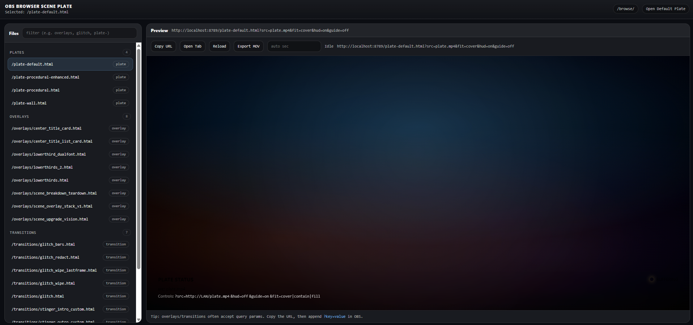

# OBS Plate Server (9:19 Browser Source)

A lightweight, containerized **local plate server** for OBS Browser Sources.

This project serves a **cinematic, OBS-ready HTML page** designed for **vertical (9:19 / 1080×1920)** scenes. It’s intended to be used as a **background plate layer** behind a green-screened camera or as a visual foundation for overlays, atmospherics, and motion graphics -- all served locally over your LAN.

No cloud dependencies. No static file dragging. Just URLs.

---

  

    
  

 

## What This Is

- A **containerized plate server stack** purpose-built for **OBS Browser Sources**  
- **Nginx-backed static hosting** for a cinematic HTML plate UI (found in `site/`)  
- **URL-driven controls** for video sources, layout fitting, HUD/debug mode, and guides  
- Optional **rendering services** (`render-api/`) to export plates as MOV assets  
- Fully **local-first**: runs on your machine or LAN with no cloud dependencies  

---

## Why This Exists

Traditional OBS workflows require:
- importing static video files  
- duplicating assets per scene  
- rebuilding scenes when backgrounds change  

This project flips that model:

**The scene stays the same.  
The URL controls the look.**

That makes it ideal for:
- live production  
- rapid iteration  
- multi-device OBS setups  
- future automation (JSON, WebSocket, timeline-driven plates)  

---

## Quick Start

### Folder Structure

├── docker-compose.yaml  
├── Dockerfile  
└── site/  
&nbsp;&nbsp;&nbsp;&nbsp;├── index.html  
&nbsp;&nbsp;&nbsp;&nbsp;└── plate.mp4  

---

### Start the Server

From the project root:

`docker-compose up -d --build`

This exposes the plate server at:

`http://<HOST_IP>:8789/`

---

## Use in OBS

Add a **Browser Source**:

- URL: `http://<HOST_IP>:8789/`
- Width: `1080`
- Height: `1920`
- Shutdown source when not visible: `OFF`
- Refresh browser when scene becomes active: `optional`

---

## URL Controls

The plate page is controlled entirely by query parameters.

### Video Source

`?src=http://<HOST_IP>:8789/plate.mp4`

You can also point to **any LAN-accessible video URL**.

---

### Layout & Debug

`&hud=off`
`&guide=on  
`&fit=cover`

Values for fit: `cover | contain | fill`

---

### Example (clean production)

`http://<HOST_IP>:8789/?src=http://<HOST_IP>:8789/plate.mp4&hud=off`

---

### Example (debug mode)

`http://<HOST_IP>:8789/?guide=on`

---

## Designed For

- OBS Studio (Browser Source)  
- Vertical video workflows  
- Green screen / keyed talent  
- Local-first production pipelines  

Future expansion paths:
- multi-plate routing  
- JSON-driven overlays  
- timeline/state-based scenes  

---

## Notes & Gotchas

- iOS editor previews may not load local video files -- OBS will.  
- Avoid smart quotes when editing index.html (they break JavaScript).  
- Test large video files over LAN first.  

---

## Stay Connected

  

    
    
    
    
    
  

---

## License

This project is licensed under the MIT License - see the LICENSES.md notice for bundled dependencies.

---

  

    
  

  
<strong>Built with ❤️ by <a href="https://github.com/Cdaprod">David Cannan</a></strong> Transforming how we discover, process, and manage digital media through AI.

